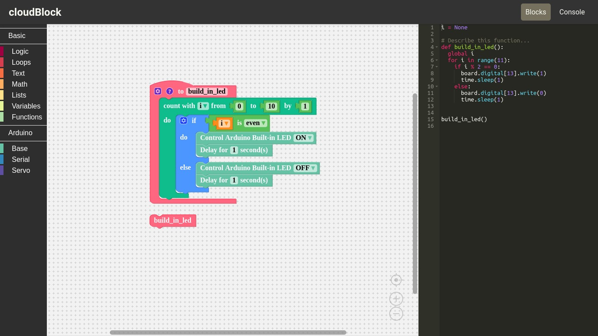

Major Project w/ Thesis: CloudBlock.

Block-based programming, designed for microcontrollers like the Arduino and Raspberry Pi, is used in the project.
This comprises of a translator that converts the block-based code to Python or JavaScript and a block-based compiler. For those just starting off with microcontroller programming, this can be quite helpful. 

